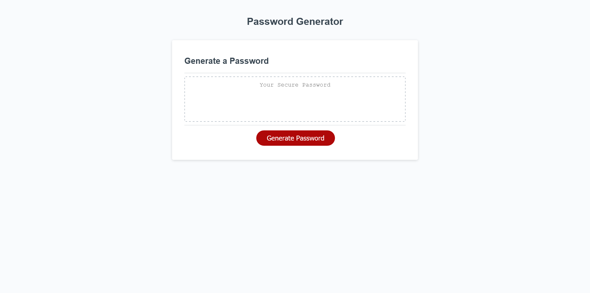
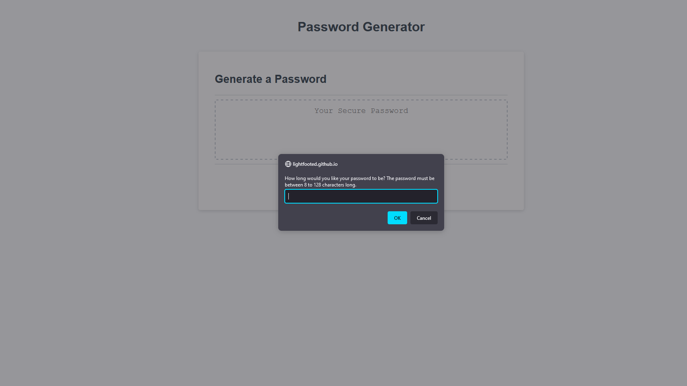
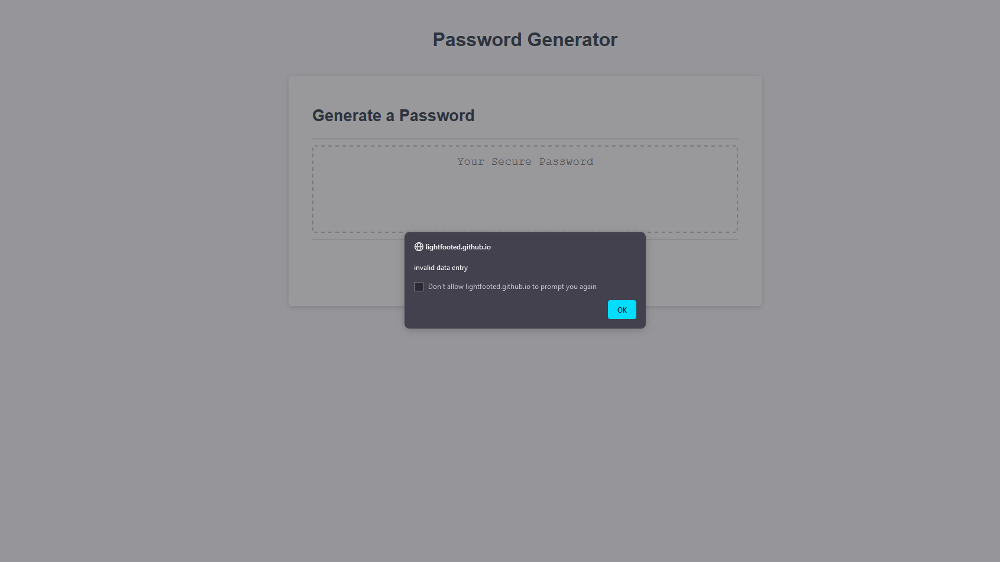

# Create Password Generator Challenge

## Description
I was tasked with creating a password generator that is between 8 to 128 characters long. An alert pops if selection is less than 8 characters. The options for the password include: lower and uppercased letter, numbers, and special characters. Once all options are selected, the password is displayed.

## Web Link
[Click here for password generator](https://lightfooted.github.io/password-generator/)

## Screenshot

Blank/Clean

Window Prompt

Alert if options not properly selected

Successful Password

## Construction
Completed by Kimberly Collazo